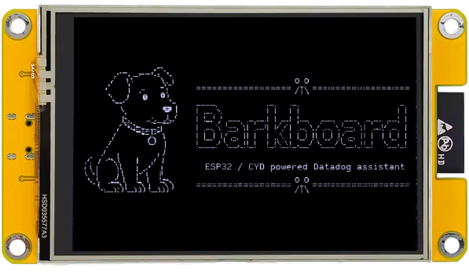

# BarkBoard



A Datadog assistant showing live monitors, incidents, on-call, and SLOs on a 2.8" CYD touchscreen sitting on your desk.

## Requirements

- **ESP32-2432S028R "CYD" board**: _Should work with multiple variations of this board._
- **Datadog Aaccount**: A free trial works) with:
  - an **API Key** (_Organization Settings → API Keys_)
  - a **scoped Application Key** (_Organization Settings → Application Keys_) with read access to **Monitors, Incidents, On-Call, SLOs, and Hosts**.
- **PlatformIO** (CLI or the VS Code extension) — only if building and flashing locally.

## Installation

1. Web Flasher

Visit the project site ([kyletaylored.com/barkboard](https://kyletaylored.com/barkboard)) and use the web flasher. Plug in your board, connect to the port, and start the flashing operation.

2. Local Flasher

Clone the repository locally, connect your board, and run the commands below.

```sh
make build   # compile only
make flash   # upload to the board, then drop into the serial monitor
```

The Makefile auto-detects the connected USB-serial device — override explicitly if you have more than one attached:

```sh
make flash PORT=/dev/cu.usbserial-1420
```

> [!TIP] Other useful targets
> `make monitor` (serial monitor only)
> `make erase-flash` (wipe the whole flash chip for a clean-slate test)
> `make reflash` (erase + upload + monitor in one go)
> Run `make help` for the full list.

## Setup

1. **Join the setup network.** On first boot (or after a factory reset), the board broadcasts an open WiFi network named **`BarkBoard-XXXX`** — no password. Join it from your phone or laptop.
2. **Pick your home WiFi.** Open the captive portal (sometimes opens automatically, some have to tap "sign in" on the the mobile network screen) with a scanned list of nearby 2.4GHz networks.
3. **Open the setup page.** Once connected, reach the device at `http://barkboard.local` or the IP address shown on the panel.
4. **Enter your Datadog keys.** Just two fields — **API Key** and **Application Key**. There's no site/region dropdown to fill in: the device detects it automatically (usually within a couple of seconds).
5. **Optional preferences**, same page: a team filter (leave it blank and the device auto-detects your team from your API key), 12h/24h clock format, and a status-LED style.

A **"Forget WiFi & keys"** button on the same setup page resets everything and reboots into a fresh portal session.

## Screens

Five rotating dashboards (swipe or tap the page dots), plus drill-in detail views:

| Screen        | What's on it                                                                                                                      |
| ------------- | --------------------------------------------------------------------------------------------------------------------------------- |
| **Overview**  | Big ALERT/WARN/OK monitor counts, open incident count + highest severity                                                          |
| **Monitors**  | Filterable list; tap a row for detail — live metric sparkline, mute/unmute, declare a case/incident, trigger a Bits investigation |
| **Incidents** | Active incidents with SEV-1..5 badges; tap for detail and to cycle incident state                                                 |
| **On-Call**   | Current on-call + escalation roster for your team, auto-detected from your API key                                                |
| **SLOs**      | Configured SLOs; tap one for an arc gauge showing remaining error budget                                                          |

Plus a Settings screen (WiFi/site info, re-detect tenant, factory reset) and an animated idle screen.

## Good to know

- The panel is dim and color-shifts if you view it off-axis — for best legibility, view it straight-on.
- The onboard RGB status LED's red channel doesn't light on this board revision, so status colors use green/blue only for now.

## Credits

Inspired by [justynroberts/pagerduty-cyd](https://github.com/justynroberts/pagerduty-cyd).

## License

See [`LICENSE`](./LICENSE).
